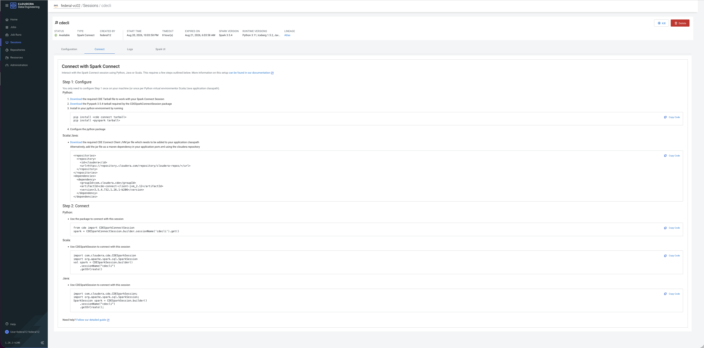

# Data Engineering Workshop — PySpark, Data Quality & Airflow on Cloudera CDE

Welcome! In this workshop you will build a **real data pipeline** step by step — the same kind used in production at large companies. You don't need to be an expert. Just follow each step in order and you will be fine.

---

## What Will You Build?

You will take a raw CSV file of retail orders and turn it into clean, queryable data tables — automatically, every 5 minutes, on Cloudera's cloud platform.

Here is the full journey your data takes:

```
Your CSV File
      │
      ▼
① EXPLORE    → Look at the data. Understand its shape, columns, and problems.
      │
      ▼
② INGEST     → Read the CSV. Save it as a fast Parquet file, organised by date.
      │
      ▼
③ VALIDATE   → Check the data quality. If anything looks wrong, STOP here.
      │            (Don't let bad data go further!)
      ▼
④ TRANSFORM  → Clean it up. Add new columns like "revenue". Group by customer.
      │
      ▼
⑤ LOAD       → Save the final tables. Register them so they can be queried with SQL.
      │
      ▼
⑥ ORCHESTRATE → Set up Airflow to run all these steps automatically on a schedule.
      │
      ▼
⑦ CI/CD      → Every time you push code to GitHub, tests run and the pipeline redeploys.
```

**Total time:** ~4 hours

---

## What Is Cloudera CDE?

Think of Cloudera Data Engineering (CDE) as **Spark-as-a-service on AWS**. Instead of setting up servers yourself, CDE gives you:
- A place to run Spark jobs (your code)
- A managed Airflow to schedule those jobs
- A Python environment for your dependencies
- Everything secured and connected to your S3 bucket

You write your code locally on your laptop, deploy it to CDE with one script, and CDE runs it on real cloud infrastructure.

---

## Before You Start — What You Need

Check all of these before the workshop begins:

- [ ] **Python 3.11** installed on your laptop
  ```bash
  python3.11 --version   # should print Python 3.11.x
  ```
- [ ] **IntelliJ IDEA** or **PyCharm** installed
- [ ] **Git** installed
- [ ] **CDE virtual cluster URL** — your instructor will give you this (looks like `https://xxxxx.cde.cloudera.com`)
- [ ] **CDE CLI installed** — ask your instructor if unsure

---

## Part 0 — Set Up Your Laptop (Do This First)

You only need to do this once. It takes about 15 minutes.

### 0.1 — Get the code

```bash
git clone <repo-url>
cd Spark-Workshop-Airflow-Git
```

### 0.2 — Create a Python environment

This keeps the workshop packages separate from everything else on your laptop.

```bash
python3.11 -m venv ~/venvs/cde-spark
source ~/venvs/cde-spark/bin/activate     # Mac / Linux
# .\venvs\cde-spark\Scripts\activate      # Windows
```

You should see `(cde-spark)` at the start of your terminal prompt. That means it worked.

### 0.3 — Install the packages

CDE uses a special version of Spark. You need two tarballs from your CDE session:

1. Open the **CDE console** in your browser
2. Go to **Sessions → your session → Spark Connect → Configuration**
3. Download the two `.tar.gz` files shown there
4. Run:

```bash
pip install -r requirements.txt
pip install /path/to/cdeconnect-*.tar.gz
pip install /path/to/pyspark-3.5.*.tar.gz
```

> **Install order matters.** `requirements.txt` must go first — it pulls in a floor version of `pyspark`. The CDE tarballs go last so the exact CDE-matched `pyspark` build wins. If you ever re-run `pip install -r requirements.txt` after this, reinstall the `pyspark-3.5.*.tar.gz` tarball again afterward, or you'll silently fall back to a pip-resolved `pyspark` that lacks the Spark Connect module CDE needs.

> **Why two files?** The first file (`cdeconnect`) lets your laptop talk to CDE. The second (`pyspark`) must match the exact Spark version CDE uses — otherwise they won't understand each other.

### 0.4 — Point IntelliJ to your Python environment

1. Open IntelliJ → **File → Project Structure → SDKs**
2. Click **`+`** → **Add Python SDK → Existing environment**
3. Set the path to: `~/venvs/cde-spark/bin/python`
4. Name it exactly: **`Python 3.11 (cde-spark)`**
5. Click **OK**

The red "No Python interpreter" warning will disappear.

### 0.5 — Configure the CDE CLI

Open (or create) the file `~/.cde/config.yaml` and add:

```yaml
vcluster-endpoint: https://<your-cde-endpoint>/dex/api/v1
```

Your instructor will give you the endpoint URL.

### 0.6 — Test your connection

```bash
python tests/test_cde_connect.py
```

Expected output:
```
Connecting to CDE session: <session-name>
Spark version  : 3.5.x
spark.range(10).count() = 10
SUCCESS: IDE → CDE Spark Connect session is working.
```

If you see this — great, you are ready! If not, ask your instructor.

Before you troubleshoot, cross-check the CDE console's **Sessions → your session → Connect** tab against your local setup — it shows the exact Spark version and connection snippet your session expects:



What to check against this page:
- **SPARK VERSION** (top of page) must match the `pyspark-3.5.*.tar.gz` tarball you installed — a mismatch is the most common cause of `ModuleNotFoundError: No module named 'pyspark.sql.connect'`.
- **STATUS** must be `Available` — a `killed` session (TTL expired, default 8h) needs recreating: `cde session create --name <name> --type spark-connect`.
- **SESSION_NAME** in `tests/test_cde_connect.py` must exactly match the session name shown in the page breadcrumb.

---

## Part 1 — Run the Demos (See It Working First)

Before writing any code yourself, run the demos to see the full pipeline working.

Open each file in IntelliJ and set your session name at the top:
```python
CDE_SESSION_NAME = "your-session-name"   # change this line
```

Then run them in order:

| Demo | File | What it does |
|------|------|-------------|
| 1 | `demos/demo_explore.py` | Shows you the dataset — row counts, columns, sample data |
| 2 | `demos/demo_etl.py` | Runs the full pipeline on sample data in one shot |

Both demos use **built-in sample data** — no S3 setup needed. Just run and watch.

---

## Part 2 — The Workshop Modules

Now it's your turn. Work through the modules **in order**. Each one builds on the previous.

Every module has:
- 📖 A **README** explaining the concept (read this first)
- ✏️ An **exercise file** with `# TODO` comments — this is where you write code
- ✅ A **reference solution** in `jobs/` or `dags/` — peek if you get stuck

---

### Module 01 — Explore the Data
**Folder:** `modules/01-explore/`
**Time:** ~20 minutes

Learn to look at a dataset before touching it. You will check:
- How many rows? What columns?
- Are there nulls? Duplicates?
- What do the values look like?

**Exercise file:** `demos/demo_explore.py`

---

### Module 02 — Ingest
**Folder:** `modules/02-ingest/`
**Time:** ~30 minutes

Read the raw CSV file and save it as Parquet — a faster, compressed format used in all real data pipelines. You will also partition the data by date so queries run faster later.

**Exercise file:** `modules/02-ingest/exercise_ingest.py`
**Reference solution:** `jobs/ingest/ingest_raw.py`

---

### Module 03 — Transform
**Folder:** `modules/03-transform/`
**Time:** ~45 minutes

Take the raw data and make it useful:
- Remove rows with missing values
- Add a `revenue` column (`quantity × unit_price`)
- Group orders by customer and by product category

**Exercise file:** `modules/03-transform/exercise_transform.py`
**Reference solution:** `jobs/transform/transform.py`

---

### Module 04 — Load
**Folder:** `modules/04-load/`
**Time:** ~30 minutes

Write the final transformed data to its permanent home on S3. Then register it as a Hive table so anyone on the platform can query it with SQL.

**Exercise file:** `modules/04-load/exercise_load.py`
**Reference solution:** `jobs/load/load_curated.py`

---

### Module 05 — Data Quality
**Folder:** `modules/05-data-quality/`
**Time:** ~45 minutes

Use **Great Expectations** to define rules about your data:
- No null order IDs
- Quantity must be greater than 0
- Category must be one of a known list

If any rule fails, the pipeline stops — protecting downstream tables from bad data.

**Exercise file:** `modules/05-data-quality/exercise_validate.py`
**Reference solution:** `jobs/validate/validate_data.py`

---

### Module 06 — Orchestrate with Airflow
**Folder:** `modules/06-orchestrate/`
**Time:** ~40 minutes

Wire all four jobs together into one Airflow DAG. Airflow will run them in the right order automatically on a schedule. If any job fails, the rest won't run.

```
ingest_raw → validate_data → transform → load_curated
```

**Exercise file:** `modules/06-orchestrate/exercise_dag.py`
**Reference solution:** `dags/etl_pipeline_dag.py`

---

### Module 07 — CI/CD with GitHub
**Folder:** `modules/07-cicd/`
**Time:** ~30 minutes

Set up automation so that every time you push code:
- Tests run automatically (catches bugs before they reach production)
- When code merges to `main`, a reminder step fires — actual redeploy to CDE is a manual command (`make deploy`), since Cloudera's CLI has no public download a GitHub-hosted runner can install. See `modules/07-cicd/README.md` for why and how to get full automation if you need it.

**Files:** `.github/workflows/ci.yml`, `.github/workflows/cd.yml`

---

## Part 3 — Deploy Everything to CDE

When you are done with the exercises, run these two scripts to deploy the full pipeline to CDE:

```bash
# Step 1 — Deploy the Spark jobs
./scripts/deploy_jobs.sh

# Step 2 — Deploy the Airflow DAG
./scripts/deploy_dag.sh
```

You can run these scripts from any folder — they always find the right files automatically.

After deploying, go to the **CDE Airflow UI → DAGs** and you will see `retail_etl_pipeline` running on its schedule.

---

## Part 4 — Check the Results

Once the pipeline has run, you can query the output tables in Cloudera:

```sql
-- See the orders
SELECT * FROM workshop_db.orders LIMIT 10;

-- Who spent the most?
SELECT * FROM workshop_db.customer_summary
ORDER BY total_revenue DESC;

-- Which product category sells best?
SELECT * FROM workshop_db.category_summary
ORDER BY total_revenue DESC;
```

Run these in **Cloudera Data Warehouse (CDW)** → Hue SQL Editor, or any Impala/Hive client.

---

## Helpful Things to Know

### The data flows through these S3 locations:

| Stage | S3 Path | What's stored |
|-------|---------|--------------|
| Raw | `s3a://federal-buk-574bcea0/workshop/raw/` | Original CSV converted to Parquet |
| Validated | `s3a://federal-buk-574bcea0/workshop/validated/` | Cleaned and enriched data |
| Curated | `s3a://federal-buk-574bcea0/workshop/curated/` | Final tables (also in Hive) |

<!-- Previous environment used s3a://go01-demo/workshop/ — kept here for reference if you ever redeploy against that cluster. -->

### What if I don't have S3 configured?

No problem! If the Airflow `S3_BUCKET` variable isn't set, jobs automatically fall back to using **built-in sample data**, but they still write output to the default bucket hardcoded in each job script (`DEFAULT_RAW_PATH` etc. in `jobs/*.py`) — currently `s3a://federal-buk-574bcea0/workshop/`. Point that constant at whatever bucket your CDE cluster's IAM role can actually write to before running the pipeline.

### Where are the reference solutions?

| Module | Reference solution |
|--------|-------------------|
| Ingest | `jobs/ingest/ingest_raw.py` |
| Transform | `jobs/transform/transform.py` |
| Load | `jobs/load/load_curated.py` |
| Validate | `jobs/validate/validate_data.py` |
| Airflow DAG | `dags/etl_pipeline_dag.py` |

### I'm stuck on a TODO — what do I do?

1. Read the comment above the `TODO` — it always has a hint
2. Look at the matching reference solution in `jobs/`
3. Ask your instructor

---

## CI/CD Setup (For Module 07)

CI (lint/test on every PR) works out of the box with no setup. CD (deploy on merge) is
**manual** in this workshop — Cloudera doesn't offer a public download for the CDE CLI, so
a GitHub-hosted runner can't install it, and this repo being public rules out hosting
Cloudera's binary as a release asset. `cd.yml` runs on every merge to `main` but only
prints a reminder; it does not deploy.

**After merging to `main`, deploy yourself:**
```bash
./scripts/deploy_jobs.sh
./scripts/deploy_dag.sh
# or: make deploy
```

If you want true end-to-end automation, `modules/07-cicd/README.md` covers two options: a
self-hosted GitHub Actions runner (on a machine with the CDE CLI already installed), or a
private mirror repo for the CLI binary. The four secrets below are only needed for those
paths, not for the default manual-deploy flow:

**Settings → Secrets and variables → Actions → New repository secret**

| Secret name | What to put there |
|-------------|------------------|
| `CDP_ENDPOINT` | Your Cloudera CDP control plane URL |
| `CDP_ACCESS_KEY` | Your CDP access key |
| `CDP_PRIVATE_KEY` | Your CDP private key |
| `CDE_VC_ENDPOINT` | Your CDE virtual cluster endpoint URL |

Your instructor will give you these values.

---

## Repo Layout

```
├── demos/                          ← Run these first to see the pipeline working
│   ├── demo_explore.py
│   └── demo_etl.py
│
├── modules/                        ← Your exercises — work through in order
│   ├── 01-explore/
│   ├── 02-ingest/
│   ├── 03-transform/
│   ├── 04-load/
│   ├── 05-data-quality/
│   ├── 06-orchestrate/
│   └── 07-cicd/
│
├── jobs/                           ← Reference solutions (also deployed to CDE)
│   ├── ingest/ingest_raw.py
│   ├── transform/transform.py
│   ├── load/load_curated.py
│   └── validate/validate_data.py
│
├── dags/
│   └── etl_pipeline_dag.py         ← Airflow DAG (module 06 reference solution)
│
├── scripts/
│   ├── deploy_jobs.sh              ← Run this to deploy Spark jobs to CDE
│   └── deploy_dag.sh               ← Run this to deploy the Airflow DAG to CDE
│
├── tests/
│   └── test_cde_connect.py         ← Run this to test your laptop → CDE connection
│
└── great_expectations/             ← Data quality rules (module 05)
```

---

## Quick Reference — CDE CLI Commands

```bash
# Check your jobs
cde job list

# Run a job manually
cde job run --name workshop-ingest-raw

# Check job run status
cde run list --job-name workshop-ingest-raw

# View logs for a specific run
cde run logs --id <run-id> --type driver/stderr
```

---

*Questions? Ask your instructor or raise an issue in this repo.*
